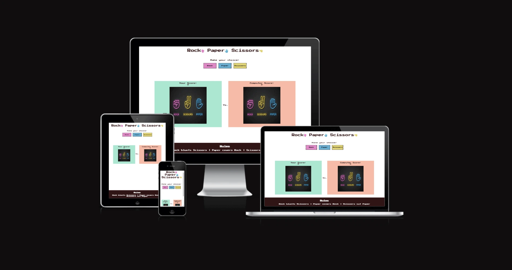
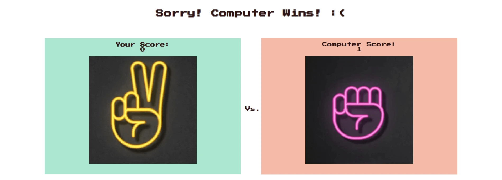

# Rock - Paper - Scissors
## [my-second-project](https://empzsolt.github.io/my-second-project-/)
The simple "Rock, Paper, Scissors" is an interesting game. As we used to settle disputes in the past, now it offers an easily accessible online entertainment. In its current version, the fight is against a randomly choosing computer, which ensures a fair game.

The game users can relive their childhood and test their patience and luck during a easy game. It can help promote problem-solving thinking. Finally, it can cause happy moments for people of all ages.

## Contents
- [Design](#design)
     * [Color Scheme](#color-scheme)
     * [Typography](#typography)
     * [Imagery](#imagery)
     * [Features](#features)
     * [Accessibility](#accessibility)
- [Technologies Used](#technologies-used)
     * [Languages Used](#languages-used)
     * [Libraries & Programs Used](#libraries--programs-used)
- [Deployment and Local Development](#deployment-and-local-development)  
     * [Deployment](#deployment)
     * [Local Deployment](#local-development)
          * [How to Fork](#how-to-fork)
          * [How to Clone](#how-to-clone)
- [Testing](#testing)
     * [Bugs](#bugs)
     * [W3C Validator](#w3c-validator)
     * [JSHint JavaScript Validator](#jshint-javascript-validator)
     * [Lighthouse](#lighthouse)
          * [Index page](#index-page)
- [Credits](#credits)
     * [Code Used](#code-used)
     * [Content](#content)
     * [Media](#media)
          * [Hotel images](#hotel-images)
          * [Honeymoon images](#honeymoon-images)
          * [RSVP icons](#rsvp-icons)
     * [Acknowledgments](#acknowledgments)

## Design
### Typography
Google Fonts was used for the following font:
- Press Start 2P is a bitmap font based on the font design from 1980s Namco arcade games. It works best at sizes of 8px, 16px and other multiples of 8. Although the design of uppercase letters and digits dates back to Atari's "Sprint" (1977), the specific glyph forms in this TrueType conversion are based on those from "Return of Ishtar" (1986), one of the first games to include and regularly use lowercase as well as uppercase letters in its screen font. 
### Imagery
- I found the introductory rock-paper-scissors image on a public website. I cut the various items from the introductory picture. I have credited this in the credits section.
### Features
- Header
     * It is located at the top of the web page and contains the name of the game supplemented with font awesome icons. The icons represent the given items, their colors are the same as the colors seen in the introductory image, thereby strengthening the connection between them, and they are also animated to indicate the nature of the elements. The choice of font is also emphasized here, which is reminds of an arcade game.
     * This section is intended to inform the user about the topic of the page.
     
- The game options
     * The game options use interactive buttons to choose between three items: Rock, Paper, Scissors. Furthermore, the colors of the buttons harmonize with the colors of the items shown in the introductory image.
     * This area clearly present the choices if the user wants to play.
     
- The game results
     * As soon as the user has selected a button, the symbol that belonged to the button will appear on the player's display, on the left side of the screen.
     * A random symbol generated by JavaScript code appears on the computer display, on the right side of the screen. At the same time, the code decides who the winner is based on the entered rules.
     * A small message pops up between the chosen symbols and the game option buttons, telling the player who the winner is. Furthermore, the scores are updated on the player's or computer's display.
     * The result is obvious and the explanation of the points is clear and clearly visible to the player, making the game completely transparent.
     
- The Footer
     * The footer presents the rules of the game.
     * Knowing the rules is indispensable for the player to understand and enjoy the game.
     
- Features Left to Implement
     * Possibility of further development:
          - by adding additional items, for example: Lizard, Spok, or inventing completely new characters
          - by adding user vs user mode, connect two users to play online
     
### Accessibility
During the coding, I made sure that the website was as user-friendly as possible. I achieved this by:
- Using Semantic HTML.
- Using descriptive alt attributes on images on the site.
- Providing information for screen readers where there are icons used and no text.
- Ensuring that there is a sufficient colour contrast throughout the site.
## Technologies Used
### Languages Used
HTML, CSS and JavaScript were used to create this website.
### Libraries & Programs Used
Git - For version control.
Github - To save and store the files for the website.
Google Fonts - To import the fonts used on the website.
Font Awesome / Flaticon / Pinterest - For the iconography on the website.
Google Dev Tools - To troubleshoot and test features, solve issues with responsiveness and styling.
Tiny PNG - To compress images.
FreeConvert - To compress images in the webp format.
Am I Responsive? - To show the website image on a range of devices.
Paint - To cut the images to the right size.
## Deployment and Local Development
### Deployment
The site is deployed using GitHub Pages. Visit the deployed site [here](https://empzsolt.github.io/my-second-project-/). To deploy using GitHub pages:
 1. Login or Sign Up to GitHub.
 2. Open the project repository.
 3. Click on "Settings" on the navigation bar under the repository title.
 4. Click on "Pages" in the left hand navigation panel.
 5. Under "Source", choose which branch to deploy. This should be Main for newer repositories (older repositories may still use Master).
 6. Choose which folder to deploy from, usually "/root".
 7. Click "Save", then wait for it to be deployed. It can take some time for the page to be fully deployed.
 8. Your URL will be displayed above "Source".
### Local Development
#### How to Fork
To fork the Bully-Book-Club repository:
1. Log in (or sign up) to Github.
2. Go to the repository for this project, kera-cudmore/Bully-Book-Club.
3. Click the Fork button in the top right corner.
#### How to Clone
To clone the Bully-Book-Club repository:
Log in (or sign up) to GitHub.
Go to the repository for this project, kera-cudmore/Bully-Book-Club.
Click on the code button, select whether you would like to clone with HTTPS, SSH or GitHub CLI and copy the link shown.
Open the terminal in your code editor and change the current working directory to the location you want to use for the cloned directory.
Type 'git clone' into the terminal and then paste the link you copied in step 3. Press enter.
## Testing
Testing took place continuously during the entire construction. I used Chrome's developer tools during the build to try out new ideas and prevent or, if necessary, fix problems.
During the development, I used Google's developer tools to ensure everything worked as expected, to successfully discover bugs, determine their origin, and fix them.
- I tested playing this game in different browsers: Microsoft Edge, Google Chrome, Firefox.
- I confirmed that this game results are always correct.
- I confirmed that this project is responsive, functions on all standard screen sizes using the devtools device toolbar.
- I confirmed that the header, game options, game results and the footer are all readable and easy to understand.
### Bugs
- The first time I changed the font, the text hung over one of the buttons in the game options. This is how I increased the original size settings of the buttons.
- At first, I did not notice that the name of the score collector on both displays was "Your scores". Only after a few tests did the mistyping become apparent.
- When I decided to put a versus text between the two displays, I couldn't manage to keep it centered and responsive. Then I created a wrapper div for the game zone and set display to flex , flex-direction to row and justify-content to center . 
- The JavaScript code did not want to work before the first run. When I reviewed the code, I found a typo in the constants.
- With the appearance of the scissors symbol, the display size always became a little smaller. I solved the problem by resizing the image.
### W3C Validator
The W3C validator was used to validate the HTML. It was also used to validate CSS in the style.css file.
- No errors were returned when passing through the official [W3C HTML Validator](./assets/images/html-validator.webp)
- No errors were found when passing through the official [CSS Validator](./assets/images/css-validator.webp)
### JSHint JavaScript Validator
The JSHint JavaScript Validator was used to validate the JavaScript code.
- No errors were returned when passing through the official [JSHint JavaScript Validator](./assets/images/js-validator.webp), but 15 warnings appeared, the vast majority of which indicate that I am using a keyword introduced in the ECMAScript 6 (ES6) version, and on one occasion that I am using a function inside a loop, which can be confusing. Despite all this, the game works perfectly.
### Lighthouse
I used Lighthouse within the Chrome Developer Tools to allow me to test the performance, accessibility, best practices and SEO of the website.
#### Index page
Final lighthouse testing:
- [Desktop size](./assets/images/lighthouse-desktop-final.webp)
      Suggestions:
      1. Polyfills and transforms enable legacy browsers to use new JavaScript features. However, many aren't necessary for modern browsers. For your bundled JavaScript, adopt a modern script deployment strategy using module/nomodule feature detection to reduce the amount of code shipped to modern browsers, while retaining support for legacy browsers. - Despite the problem, the game works perfectly.
      2. Set an explicit width and height on image elements to reduce layout shifts and improve CLS. - I didn't use specific numbers to scale the images to keep them responsive.
- [Mobile size](./assets/images/lighthouse-mobile-final.webp)
      Suggestions:
      1. Polyfills and transforms enable legacy browsers to use new JavaScript features. However, many aren't necessary for modern browsers. For your bundled JavaScript, adopt a modern script deployment strategy using module/nomodule feature detection to reduce the amount of code shipped to modern browsers, while retaining support for legacy browsers. - Despite the problem, the game works perfectly.
      2. Set an explicit width and height on image elements to reduce layout shifts and improve CLS. - I didn't use specific numbers to scale the images to keep them responsive.
 ## Credits
 ### Code Used
 The constant elements, the event listeners for the buttons and the playGame function come from the CodeInstitute sample portfolio project.
 ### Content
- The basic structure for the HTML and the basic sytle comes from the CodeInstitute sample portfolio project.
 ### Media
 - The [introductory image](https://www.vecteezy.com/vector-art/691497-rock-paper-scissors-neon-icons) is from a public website.
 - I cut the various items from the introductory picture.
 ### Acknowledgments
 I would like to acknowledge the following people who helped me along the way in completing my first milestone project:
 - My future wife, who gave me ideas and supported me through the project.
 - My Mentor, Graeme Taylor, who showed the direction, helped and encouraged me.
 - Matt Rudge, who gave the example for the whole project.
 - Thank you to entire Code Isntitute for making my development possible.